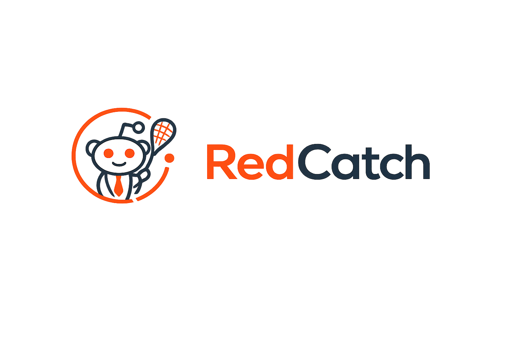

  

  # RedCatch

  Catch the hottest Reddit posts on the web.

  
  
  
  
  
  

---

## About

**RedCatch** grabs fresh content from Reddit and delivers it organized by category and across different subreddits, all directly in the browser. It consumes the Reddit JSON API directly, so no account is required.

## Features

- Browse posts by category: Popular, All, Gaming, Sports, News, Technology, Programming
- Debounced search within the current category
- Infinite scroll with automatic pagination
- Post detail modal with nested comments

---

## License

This project is licensed under the [MIT License](LICENSE).

## Contributing

Contributions are welcome! Feel free to fork the repository and submit a pull request. Please ensure your code follows the existing style and structure.
